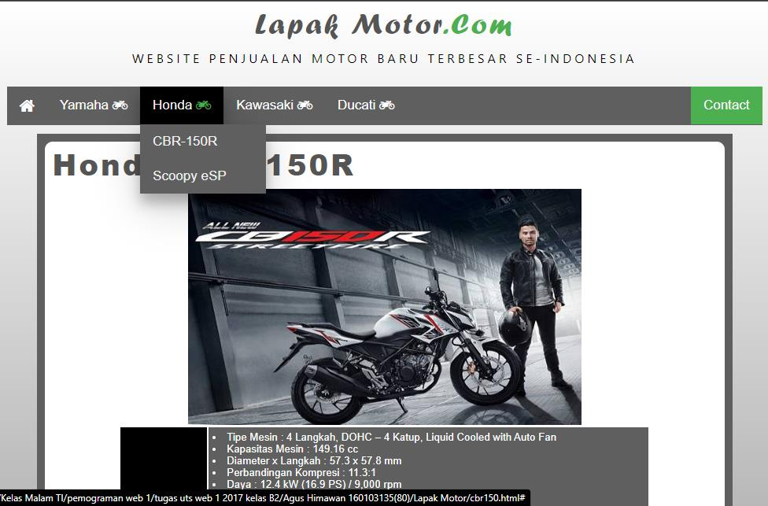
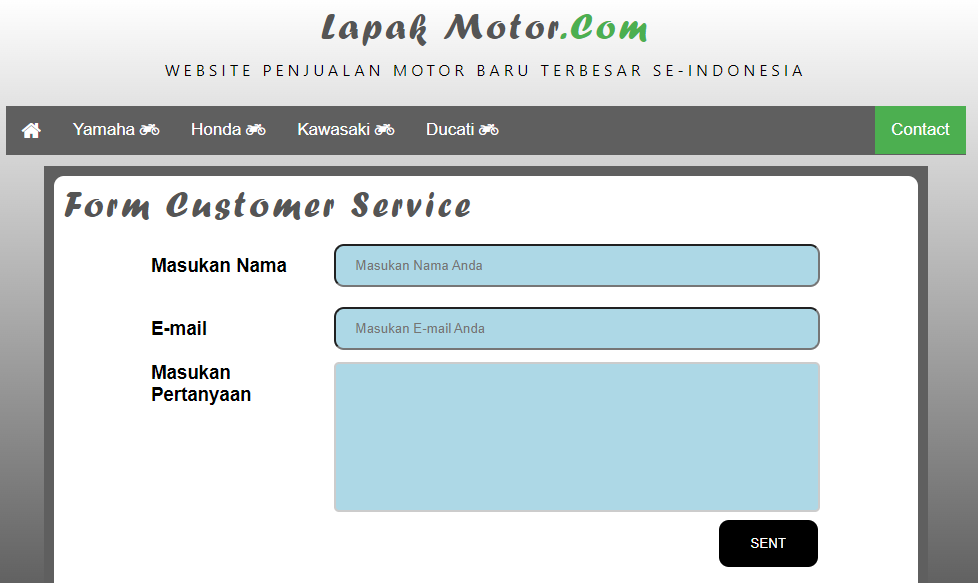

# Tugas 1 - Web 1

Matkul : Pemrograman Web 1 </br> Prodi : Teknik Informatika

## Table of contents

- [Questions](#questions)
- [Getting started](#getting-started)

## Questions

Buatlah tampilan web seperti di bawah ini  Lalu
tambahkan beberapa menu dan sub menu berupa merk semua motor dari yamaha sampai
suzuki (minimal 4 brand motor)

 Saat kursor diarahkan ke menu honda akan muncul
merk dari motor honda dan jika di klik jenis motor yang di pilih muncul detail
produk dan spesifikasi produk

 Lalu tambahkan tombol contact yang saat di klik
akan memunculkan tampilan form buku tamu yang isinya nama,email dan pertanyaan

> Ket : boleh di kreasikan dengan bentuk atau warna lain dengan css/bootstrap<

## Getting started

### Installation

```shell
pnpm install
pnpm dev
```

### Build

```shell
pnpm build
```
