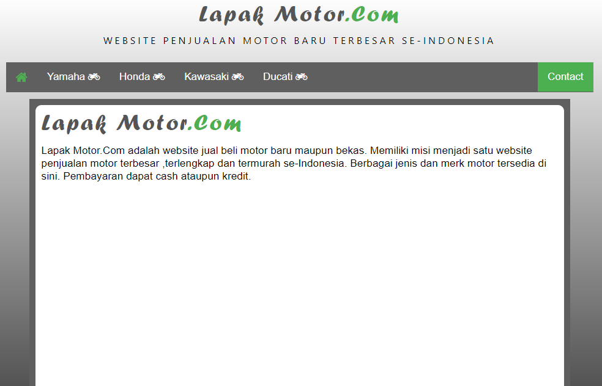

# Tugas 1 - Web 1

Matkul : Pemrograman Web 1 </br> Prodi : Teknik Informatika

## Table of contents

- [Task](#task)
- [Getting started](#getting-started)
- [Demo](#demo)

## Task

Buatlah tampilan web seperti di bawah ini  Lalu
tambahkan beberapa menu dan sub menu berupa merk semua motor dari yamaha sampai
suzuki (minimal 4 brand motor)

 Saat kursor diarahkan ke menu honda akan muncul
merk dari motor honda dan jika di klik jenis motor yang di pilih muncul detail
produk dan spesifikasi produk

 Lalu tambahkan tombol contact yang saat di klik
akan memunculkan tampilan form buku tamu yang isinya nama,email dan pertanyaan

> Ket : boleh di kreasikan dengan bentuk atau warna lain dengan css/bootstrap

## Getting started

Website sederhana yang dikembangkan untuk platform jual beli motor. Menggunakan file [products.js](./public/js/products.js) sebagai sumber data untuk mengelola informasi produk. Fitur utama mencakup pencarian motor berdasarkan brand dan model, serta menampilkan detail dari setiap motor yang tersedia.

### Installation

```shell
pnpm install
pnpm watch
```

### Build

```shell
pnpm build
```

### Configuration after build

Change **_global.css_** with **_style.css_**

```html
<!-- Before -->
<link href="./css/global.css" rel="stylesheet" />

<!-- After -->
<link href="./css/style.css" rel="stylesheet" />
```

### Running with http server

```shell
pnpm start
```

## Demo
### [DEMO](https://wachidamirul.github.io/tugas1-web1/)
